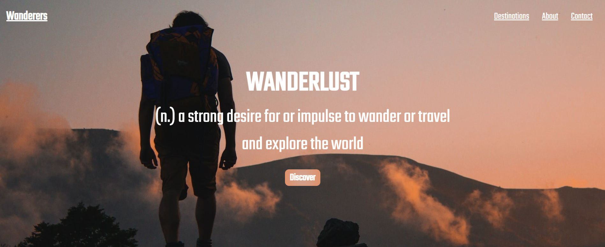
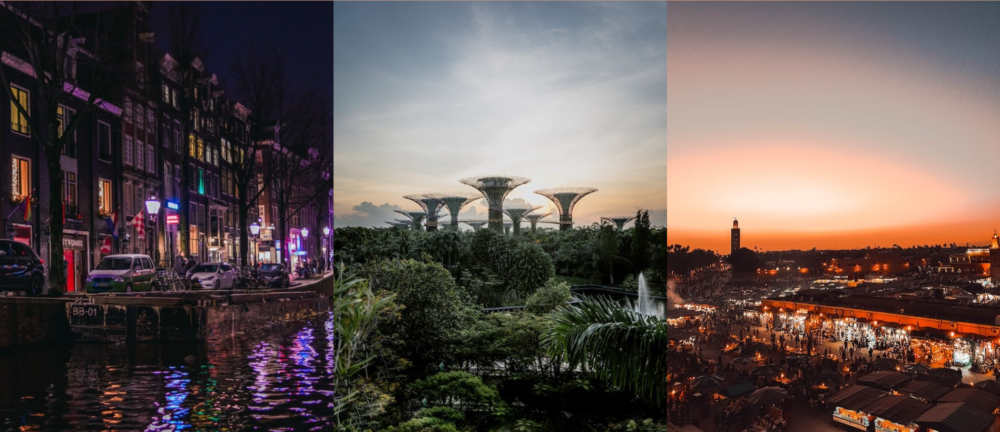
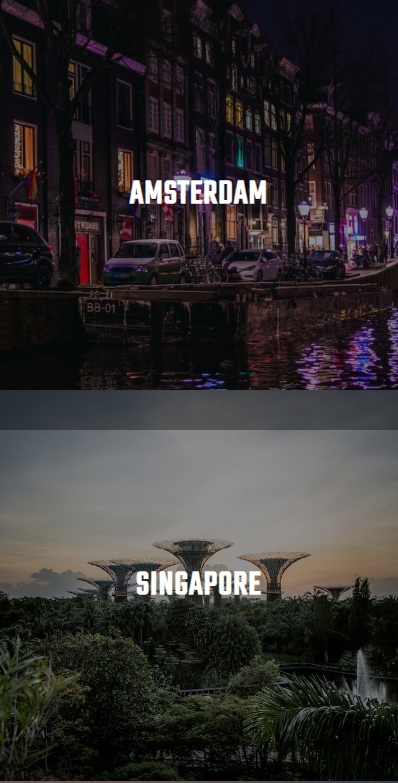
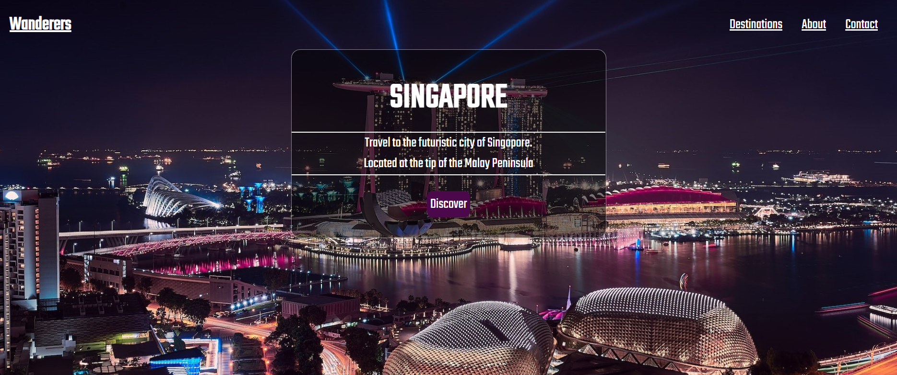
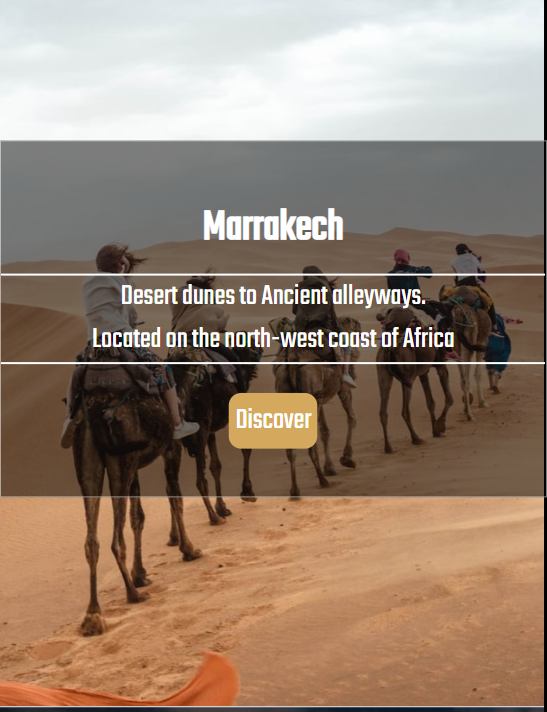
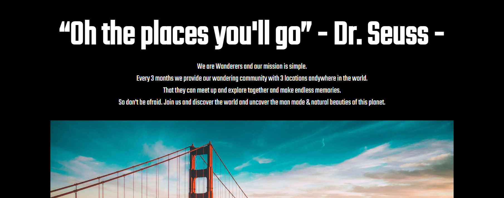
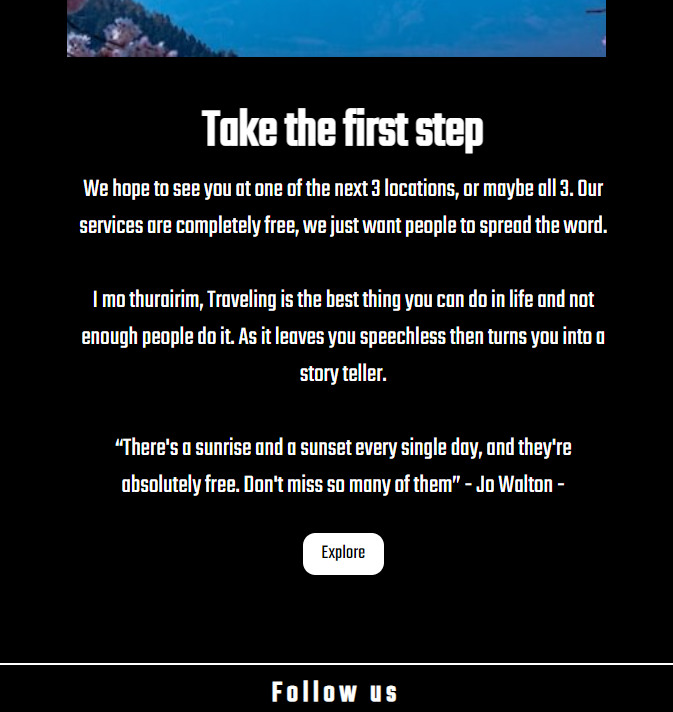
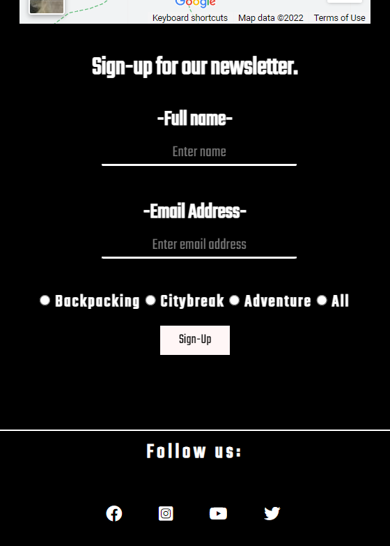
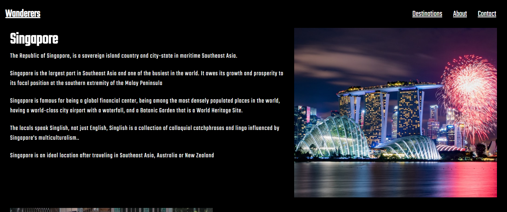
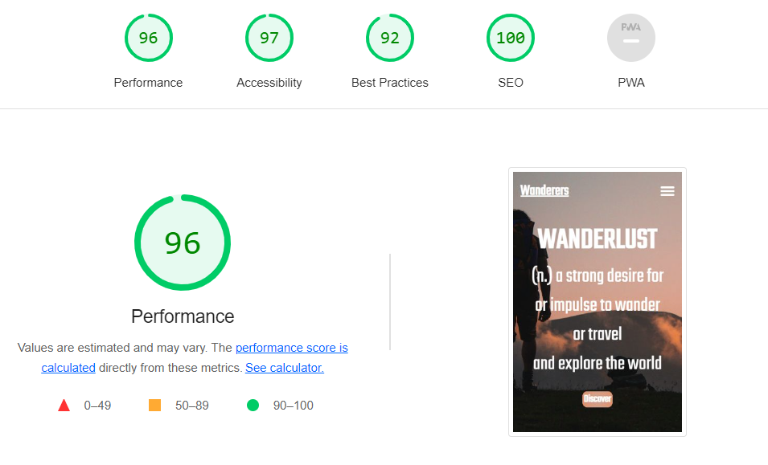

# Wanderers

Welcome to Wanderers! This is website for a fictional company called Wanderers. Wanderers is a company that provides people with a community of like minded people who want to explore everything the world has to offer. Travel can be daunting especially on your own, but with a community of wanderers at your back it will make the experience will be much more enjoyable.  

[Wanderers Live Website here](https://patrickmurphy22.github.io/Wanderers/index.html)

# Table of Contents

____

1. [Overview](#overview)
2. [Features](#features)  
    * [Header](#the-header)
    * [landing section](#landing-section)
    * [Citys Section](#citys-section)
    * [Footer](#footer)
    * [Destinations Page](#destinations-page)
    * [About Page](#about-page)
    * [Contact Page](#contact-page)
    * [Location Pages](#location-pages)
    * [Further Features](#further-features)
3. [User Experience](#user-experience)
4. [Technologies](#technologies)
5. [Testing](#testing)
    * [Validator](#w3c-validator)
    * [Lighthouse](#lighthouse)
6. [Bugs](#bugs) 
7. [Credits](#credits)
    * [Code](#code)
    * [Images](#images)
8. [Acknowledgement](#acknowledgement)

---
# Overview

The purpose of this project is to demonstrate my abilities in HTML and CSS. 

It's responsive on Desktop, Tablets and Mobiles and works on multiple browsers. 

The purpose of this website is to provide everyone and anyone the opportunity to travel with a community of like minded individuals. It's for everyone.

Memebers of the community will be able to see what locations are being ventured to over the next 3 months. They can sign up to newsletters to see what dates the community will be at each location 

---

## Header

  Shown an all pages of the website.
  
  The header includes:
  
1. The title of the page  which contains a link to the landing page.
2. 3 links, Destinations, About and Contact which will take the user to each corresponding page. 
3. When screen size is reduced the 3 links will turn into a burger icon containing all 3 links.

### Header on desktops.

### Header on mobile & tablet screens

## Landing Section

   The Home page consists of a full screen hero image and text. This is to make the user experience much more streamlined and simple rather than overwhelming the user    with to many options.
   
   Content: 
   1. Image of a sole traveller hiking.
   2. The dictionary definition of Wanderlust.
   3. Call To Action to take users straight to the locations page. Where they can find the locations that the community will be traveling too. 
   
### Landing Section on Desktops

   
## Citys Section
   
   The city section contains the 3 cities that are on the communities travel list for the next 3 months. This section has several different features.
   
   On Desktop's, the feature will be a hover action that displays the name of the location over the image which users can click on to take them directly to the city's    page.
   
### City Section on Desktop

### City Section on Tablet / Mobile

## The Footer

Shown on all four pages.

The footer contains 4 social media links and icons, which will take users to the social media pages for wanderers. It's straight forward and simple.

## Destinations Page

The destination page contain:
1. 3 selected travel destinations with a full background image. 
2. The name of the Location.
4. Very brief description and location of the city.
5. Call To Action button to take the user to that location that they selected.

The Full size background images provide the user with an incredible image of the location that selected. These images are selected to contrast eachother and show keep the user engaged.

### Destination page on Desktop

### Destination page on tablets and mobiles.

On smaller screens the border containing the above information spreads to full width of the screen. 

## About Page

The about page contains:
1. A quote from Dr. Suess, which is very simplistic but exciting.
2. The desctiption of what the company/website aims to acheive. 
3. The background of the About page is a simple black background with several pictures to excite the user of what is ahead of them. 
4. The about page is very simple with only a few lines of text to quickly outline what the goal of the webiste/company is followed by some pictures. Keeping it simple to not overwhelm the user.
5. The end of the about page has a Call To Action button to take the user straight to the Destinations page to straight travelling. 

### About page on Desktops.

### About page on tablets and mobiles.

On smaller screens the images will turn into and the text will be placed above and below, to make sure that the images are still visible to users. 

## Contact Page.

The contact page contains:

1. A full black background which again keeps it simple and doesnt over whelm the user.
2. The Contact section has the email for the company and the phone number for user to contact the company.
3. A google map link to show users where the HQ is located.
4. The Sign-Up section has an input field for the users name and email address along with a radio buttons to select the type of traveling the user is most interested in. 
5. Finally a submit button to submit the users information.

### Contact page on Desktop.

### Contact page on tablets and mobiles.

On smaller devices the page changes from flex - Rowm to Flex - Column

## Locations

Locations contains:
1. The name of the travel location.
2. The history of the travel location, followed by a captivating picture.
3. Then food and attractions outline in a similar manner above. 
5. The code is simple, and copied for the other 2 locations as its was the most practical way to impliment the code. 

### Locations page on Desktop.

### Locations page on tablets and mobiles.

On smaller devices the page changes from flex - Rowm to Flex - Column

## Further Features 

In the future, features can be added such as chatrooms for the community to communicate on rather than by using external means.

The code is set to make it much easier for coder to change the locations every three months as the code was copied for each location. 

# Technology 

### Technology used 

1. HTML
2. CSS 

# Testing

Testing was carried out on HP Laptop, Macbook Pro, Iphone 11 and Samsung s22.

 ## W3C Validation
 The website raised no issues on W3C CSS or HTML 
 
 

## Lighthouse
 The Website received a total score of 97 on Lighthouse.
 

# Bugs 

Bug: Images on Iphone were zoomed in and not displaying correct image 

fix: Added Background-attachment:scrolled; which fixed issue. 

Bug: On safari the hover image wasnt working and the text wouldnt appear for the cities on the home page.
Fix: Changed css to have the name of the city visible on the images on screens below 550px.

# Credits

## Code

The code used for the Hamburger Icon was taken https://alvarotrigo.com/blog/hamburger-menu-css/.

The code for the hovering design over the 3 images on the main pages was taken from https://css-tricks.com/. 

Inspiration for the footer code was taken from The Love Running project.

All the above code was reconfigured to be useable in the Wanderers Website.

## Images
All images were taken from Unsplash.

# Acknowledgement

I would like to acknowledge all my collegues at the Code institute for helping me with some issues I had coding this site along with my partner who gave me advice in relation to UX design. 

   
